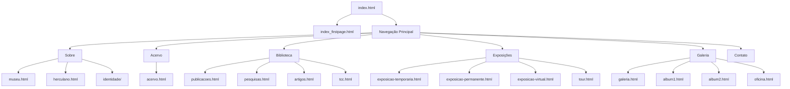

# PRD - Museu Casa Borges
## Product Requirements Document

**Versão:** 1.0  
**Data:** Janeiro 2025  
**Autor:** Barcelitos AI  
**Objetivo:** Documentação completa para migração para React

---

## 📋 SUMÁRIO EXECUTIVO

O Museu Casa Borges é um site institucional que apresenta a história e acervo do museu localizado em Barra do Bugres, MT. O projeto atual utiliza tecnologias web tradicionais (HTML, CSS, JavaScript, Bootstrap) com navegação SPA (Single Page Application) via AJAX.

### Principais Características:
- **Tipo:** Site institucional/cultural
- **Arquitetura:** SPA com carregamento dinâmico de conteúdo
- **Tecnologias:** HTML5, CSS3, JavaScript ES5, Bootstrap 4.1.3, jQuery
- **Responsividade:** Parcial (necessita melhorias)
- **Conteúdo:** 40+ páginas HTML com textos, imagens e galerias

---

## 🏗️ ARQUITETURA ATUAL

### Estrutura de Diretórios
```
INDEX/
├── 📄 index.html (página principal)
├── 📄 index_firstpage.html (página inicial)
├── 📁 jsAPP/ (scripts específicos)
├── 📁 css/ (estilos adicionais)
├── 📁 js/ (bibliotecas JavaScript)
├── 📁 bootstrap-4.1.3/ (framework CSS)
├── 📁 fotos_acervo/ (galeria principal)
├── 📁 [múltiplas pastas de imagens]
├── 📄 style.css (estilos principais)
└── 📄 [40+ páginas HTML de conteúdo]
```

### Fluxo de Navegação


---

## 📱 MAPEAMENTO DE PÁGINAS

### Páginas Principais (40+ arquivos HTML)

#### 1. **Navegação Base**
- `index.html` - Container principal com navegação
- `index_firstpage.html` - Página inicial com banner animado

#### 2. **Seção "Sobre"**
- `museu.html` - História do museu
- `herculano.html` - Arquitetura da casa
- Páginas de personalidades: `Carlos.html`, `Claudyo.html`, `Francisco.html`, `João.html`, `Judite.html`, `Luis.html`, `LuisB.html`, `Maninho.html`

#### 3. **Seção "Acervo"**
- `acervo.html` - Galeria principal com paginação
- Sistema de modal para visualização ampliada

#### 4. **Seção "Biblioteca"**
- `publicacoes.html` - Publicações do museu
- `pesquisas.html` - Trabalhos de pesquisa
- `artigos.html` - Artigos acadêmicos
- `tcc.html` - Trabalhos de conclusão

#### 5. **Seção "Exposições"**
- `exposicao-temporaria.html` - Exposições temporárias
- `exposicao-permanente.html` - Exposição permanente
- `exposicao-virtual.html` - Tour virtual
- `tour.html` - Roteiro de visita

#### 6. **Seção "Galeria"**
- `galeria.html` - Índice de álbuns
- `album1.html` - Álbum de fotos 1
- `album2.html` - Álbum de fotos 2
- `oficina.html` - Oficina de cerâmica

#### 7. **Páginas Temáticas**
- `mulheres.html` - Mulheres na história
- `quilombos.html` - Comunidades quilombolas
- `Comunidades.html` - Comunidades locais
- `barra-do-bugres.html` - História da cidade
- `terra-indigena.html` - Povos indígenas

#### 8. **Páginas Institucionais**
- `contato.html` - Informações de contato
- `equipe.html` - Equipe do museu
- `calendario.html` - Calendário de eventos
- `informes.html` - Informações gerais

---

## 🎨 SISTEMA DE DESIGN

### Paleta de Cores
```css
/* Cores Principais */
--primary-red: #d12424;     /* Vermelho institucional */
--primary-white: #ffffff;   /* Branco */
--primary-black: #000000;   /* Preto */
--text-gray: #333333;       /* Cinza para textos */

/* Cores Secundárias */
--light-salmon: rgba(255, 160, 122); /* Fundo alternativo */
--overlay-dark: rgba(0, 0, 0, 0.281); /* Overlay para banners */
```

### Tipografia
```css
/* Fonte Principal */
font-family: "Poppins", sans-serif;

/* Hierarquia Tipográfica */
.texto-titulo: 60px, weight: 600;      /* Títulos principais */
.texto-sub_titulo: 30px, weight: 600;  /* Subtítulos */
p: 18px;                               /* Texto corpo */
```

### Componentes Visuais

#### 1. **Navegação**
- Navbar Bootstrap customizada
- Cor de fundo: `#d12424`
- Dropdowns para submenus
- Links sociais (Instagram, Facebook)

#### 2. **Banner Principal**
- Altura: 100vh
- Background animado (4 imagens em rotação)
- Overlay escuro para legibilidade
- Animação: `changeBackground 15s infinite`

#### 3. **Botões**
```css
/* Botão Padrão */
.botoes button {
    height: 55px;
    width: 170px;
    border-radius: 5px;
    background: #d12424;
    color: white;
    transition: 0.3s;
}

/* Botão Outline */
.n-overlay {
    background: none;
    border: 2px solid white;
}
```

#### 4. **Cards de Galeria**
```css
.botao-galeria {
    width: 350px;
    height: 350px;
    background-size: cover;
    border-radius: 0px;
    text-shadow: outline preto;
}
```

#### 5. **Sistema de Grid para Acervo**
```css
.gallery-container {
    display: grid;
    grid-template-columns: repeat(auto-fit, minmax(250px, 1fr));
    gap: 20px;
    padding: 20px;
}
```

### Responsividade
- **Breakpoints:** Baseado em Bootstrap 4.1.3
- **Mobile:** Melhorias implementadas recentemente
- **Problemas identificados:** Overflow horizontal em alguns componentes

---

## ⚙️ FUNCIONALIDADES JAVASCRIPT

### Sistema de Navegação SPA

#### 1. **index.js - Controlador Principal**
```javascript
// AIDEV-NOTE: Gerenciamento de estado de navegação
function saveNavegation(options) {
    // Carrega conteúdo via AJAX no div #conteudo
    // Gerencia histórico do navegador
    // Controla session storage
}

// Event Listeners para todos os botões de navegação
$("#btnMuseu").on("click", function() {
    saveNavegation({ page: "museu.html" });
});
```

#### 2. **acervo.js - Galeria Avançada**
```javascript
// AIDEV-NOTE: Sistema completo de galeria
- Modal de visualização ampliada
- Navegação entre imagens (anterior/próxima)
- Sistema de paginação (12 itens por página)
- Lazy loading de imagens
- Controles de zoom
```

#### 3. **Galeria.js - Navegação de Álbuns**
```javascript
// AIDEV-NOTE: Controle simples de álbuns
$("#btnAlbum1").on("click", function() {
    saveNavegation({ page: "album1.html" });
});
```

### Funcionalidades Específicas

#### 1. **Sistema de Modal (Bootstrap)**
- Visualização ampliada de imagens
- Navegação por teclado (setas)
- Fechamento por ESC ou clique fora

#### 2. **Paginação Dinâmica**
- Controle de páginas numeradas
- Informações de contagem
- Botões anterior/próximo

#### 3. **Lazy Loading**
- Carregamento otimizado de imagens
- Atributo `loading="lazy"`

#### 4. **Session Storage**
- Persistência de estado de navegação
- Recuperação de posição ao recarregar

---

## 🔗 DEPENDÊNCIAS E INTEGRAÇÕES

### Bibliotecas Externas

#### 1. **Bootstrap 4.1.3**
- **Localização:** `bootstrap-4.1.3/`
- **Uso:** Grid system, componentes UI, responsividade
- **Customizações:** Cores, navbar, modals

#### 2. **jQuery 3.x**
- **Localização:** `js/jquery.min.js`
- **Uso:** Manipulação DOM, AJAX, event handling

#### 3. **Font Awesome**
- **Localização:** `font-awesome.min.css`
- **Uso:** Ícones sociais e navegação

#### 4. **Google Fonts**
- **Fonte:** Poppins (300, 400, 500, 600)
- **Carregamento:** Via CDN

### Integrações Externas

#### 1. **Redes Sociais**
- Instagram: Links diretos
- Facebook: Links diretos
- Sem widgets embarcados

#### 2. **Google Maps**
- Link direto para localização
- Sem mapa embarcado

#### 3. **Portal da Transparência**
- Link externo para portal municipal

### Assets e Recursos

#### 1. **Imagens**
- **Formatos:** JPG, JPEG
- **Organização:** Pastas temáticas
- **Otimização:** Necessária (arquivos grandes)

#### 2. **Documentos**
- **PDFs:** Artigos e publicações
- **Localização:** Pasta `Artigos/`

---

## 📊 ESPECIFICAÇÕES TÉCNICAS

### Performance Atual

#### Pontos Fortes:
- SPA reduz recarregamentos
- Lazy loading implementado
- CSS otimizado com classes específicas

#### Pontos de Melhoria:
- Imagens não otimizadas (tamanhos grandes)
- JavaScript não minificado
- Sem cache strategy
- Bootstrap completo (não tree-shaken)

### Acessibilidade

#### Implementado:
- Estrutura semântica HTML5
- Alt text em imagens
- Navegação por teclado (parcial)

#### Necessário:
- ARIA labels
- Contraste de cores melhorado
- Focus management
- Screen reader optimization

### SEO

#### Limitações Atuais:
- SPA prejudica indexação
- Meta tags básicas
- Sem structured data
- URLs não amigáveis

### Segurança

#### Pontos Positivos:
- Sem formulários de entrada
- Conteúdo estático
- Sem processamento server-side

#### Considerações:
- Validação de inputs (se implementados)
- HTTPS recomendado
- Headers de segurança

---

## 🎯 PADRÕES DE CÓDIGO

### HTML
```html
<!-- AIDEV-NOTE: Estrutura padrão de página de conteúdo -->
<div class="texto_meio">
    <div id="meio">
        <h1 class="texto-sub_titulo1">Título da Página</h1>
        <p class="recuo-primeira-linha justificado">Conteúdo...</p>
        
        <div class="d-flex justify-content-center align-items-center">
            <figure class="imagem-paginas">
                
                <figcaption style="text-align: center;">
                    Legenda da imagem
                </figcaption>
            </figure>
        </div>
        
        <h4 class="margens-autor">Nome do Autor</h4>
    </div>
</div>
```

### CSS
```css
/* AIDEV-NOTE: Padrão de comentários para documentação */
/* Componente específico com responsividade */
.componente {
    propriedade: valor;
    max-width: 100%; /* Previne overflow horizontal */
}

/* Media queries para responsividade */
@media (max-width: 767px) {
    .componente {
        /* Ajustes mobile */
    }
}
```

### JavaScript
```javascript
// AIDEV-NOTE: Padrão de event listeners
$("#elemento").on("click", function(event) {
    saveNavegation({ page: "pagina.html" });
});

// AIDEV-NOTE: Funções com responsabilidade única
function funcaoEspecifica() {
    // Implementação focada
}
```

---

## 🚀 RECOMENDAÇÕES PARA MIGRAÇÃO REACT

### Arquitetura Sugerida

#### 1. **Estrutura de Componentes**
```
src/
├── components/
│   ├── Layout/
│   │   ├── Header.jsx
│   │   ├── Navigation.jsx
│   │   └── Footer.jsx
│   ├── Gallery/
│   │   ├── GalleryGrid.jsx
│   │   ├── ImageModal.jsx
│   │   └── Pagination.jsx
│   ├── Content/
│   │   ├── ContentPage.jsx
│   │   ├── ImageFigure.jsx
│   │   └── AuthorCredit.jsx
│   └── UI/
│       ├── Button.jsx
│       ├── Card.jsx
│       └── Banner.jsx
├── pages/
├── hooks/
├── utils/
└── assets/
```

#### 2. **Tecnologias Recomendadas**
- **Framework:** Next.js 14+ (App Router)
- **Styling:** Tailwind CSS + Shadcn/UI
- **Animações:** Framer Motion
- **Imagens:** Next.js Image Optimization
- **Estado:** Zustand ou Context API
- **Roteamento:** Next.js App Router

#### 3. **Melhorias Prioritárias**
1. **Performance**
   - Otimização de imagens (WebP, AVIF)
   - Code splitting automático
   - Lazy loading nativo

2. **SEO**
   - Server-side rendering
   - Meta tags dinâmicas
   - Structured data

3. **UX/UI**
   - Transições suaves
   - Loading states
   - Error boundaries

4. **Acessibilidade**
   - ARIA completo
   - Navegação por teclado
   - Screen reader support

### Fases de Migração

#### **Fase 1: Setup e Layout**
- Configuração Next.js
- Componentes de layout
- Sistema de roteamento
- Design system base

#### **Fase 2: Páginas de Conteúdo**
- Migração de páginas estáticas
- Sistema de imagens
- Componente de conteúdo reutilizável

#### **Fase 3: Funcionalidades Avançadas**
- Sistema de galeria
- Modal de imagens
- Paginação
- Busca (se necessário)

#### **Fase 4: Otimizações**
- Performance tuning
- SEO implementation
- Acessibilidade
- PWA features

---

## 📋 CHECKLIST DE MIGRAÇÃO

### Preparação
- [ ] Auditoria completa de conteúdo
- [ ] Otimização de imagens
- [ ] Definição de design system
- [ ] Setup do ambiente Next.js

### Desenvolvimento
- [ ] Componentes de layout
- [ ] Sistema de roteamento
- [ ] Páginas de conteúdo
- [ ] Sistema de galeria
- [ ] Responsividade completa

### Qualidade
- [ ] Testes de componentes
- [ ] Testes de acessibilidade
- [ ] Performance audit
- [ ] SEO validation

### Deploy
- [ ] Configuração de hosting
- [ ] CDN para imagens
- [ ] Monitoramento
- [ ] Analytics

---

## 📈 MÉTRICAS DE SUCESSO

### Performance
- **Lighthouse Score:** 90+ em todas as categorias
- **Core Web Vitals:** Dentro dos limites recomendados
- **Tempo de carregamento:** < 3 segundos

### Acessibilidade
- **WCAG 2.1:** Nível AA compliance
- **Screen reader:** Compatibilidade completa
- **Navegação por teclado:** 100% funcional

### SEO
- **Indexação:** Todas as páginas indexáveis
- **Meta tags:** Completas e otimizadas
- **Structured data:** Implementado

### UX
- **Mobile-first:** Design responsivo completo
- **Navegação intuitiva:** Fluxos simplificados
- **Feedback visual:** Loading states e transições

---

## 🔄 MANUTENÇÃO E EVOLUÇÃO

### Conteúdo
- Sistema de CMS para atualizações
- Versionamento de conteúdo
- Backup automático

### Técnico
- Atualizações de dependências
- Monitoramento de performance
- Logs de erro

### Funcionalidades Futuras
- Sistema de busca avançada
- Comentários em artigos
- Newsletter
- Área administrativa
- API para mobile app

---

**Documento criado por:** Barcelitos AI  
**Data:** Janeiro 2025  
**Versão:** 1.0  
**Status:** Completo para migração React

---

*Este PRD serve como base completa para a migração do Museu Casa Borges para React, mantendo toda a funcionalidade atual e adicionando melhorias modernas de performance, acessibilidade e experiência do usuário.*